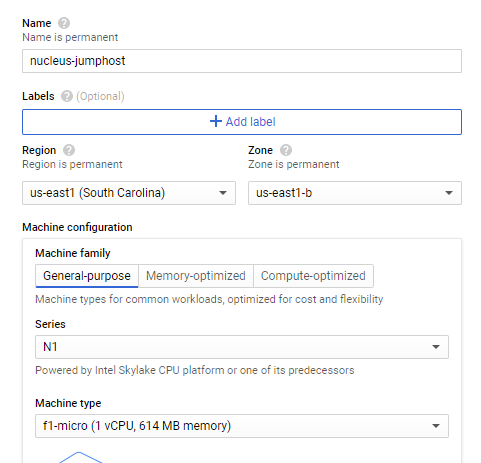

# Getting Started: Create and Manage Cloud Resources: Challenge Lab

## Task 1: Create a project jumphost instance

Navigation menu > Compute engine > VM Instance

# 

## Task 2: Create a Kubernetes service cluster

Type the following in the console:

```
gcloud config set project [VALUE ( GCP Project ID )]

gcloud config set compute/zone us-east1-b

gcloud auth login

gcloud container clusters create nucleus-jumphost-webserver1

gcloud container clusters get-credentials nucleus-jumphost-webserver1

kubectl create deployment hello-app --image=gcr.io/google-samples/hello-app:2.0

kubectl expose deployment hello-app --type=LoadBalancer --port 8080

kubectl get service
```

## Task 3: Setup an HTTP load balancer

Type the following in the console:

```
cat << EOF > startup.sh
#! /bin/bash
apt-get update
apt-get install -y nginx
service nginx start
sed -i -- 's/nginx/Google Cloud Platform - '"\$HOSTNAME"'/' /var/www/html/index.nginx-debian.html
EOF
```

1. Create an instance template :

```
gcloud compute instance-templates create nginx-template \
--metadata-from-file startup-script=startup.sh
```

2. Create a target pool :

```
gcloud compute target-pools create nginx-pool
(Select n and choose option 19)
```

3. Create a managed instance group :

```
gcloud compute instance-groups managed create nginx-group \
--base-instance-name nginx \
--size 2 \
--template nginx-template \
--target-pool nginx-pool

gcloud compute instances list
```

4. Create a firewall rule to allow traffic (80/tcp) :

```
gcloud compute firewall-rules create www-firewall --allow tcp:80

gcloud compute forwarding-rules create nginx-lb \
--region us-east1 \
--ports=80 \
--target-pool nginx-pool

gcloud compute forwarding-rules list
```

5. Create a health check :

```
gcloud compute http-health-checks create http-basic-check

gcloud compute instance-groups managed \
set-named-ports nginx-group \
--named-ports http:80
```

6. Create a backend service and attach the manged instance group :

```
gcloud compute backend-services create nginx-backend \
--protocol HTTP --http-health-checks http-basic-check --global

gcloud compute backend-services add-backend nginx-backend \
--instance-group nginx-group \
--instance-group-zone us-east1-b \
--global
```

7. Create a URL map and target HTTP proxy to route requests to your URL map :

```
gcloud compute url-maps create web-map \
--default-service nginx-backend

gcloud compute target-http-proxies create http-lb-proxy \
--url-map web-map
```

8. Create a forwarding rule :

```
gcloud compute forwarding-rules create http-content-rule \
--global \
--target-http-proxy http-lb-proxy \
--ports 80

gcloud compute forwarding-rules list
```

### (Wait for five minutes - you’ll receive 100/100. Don’t exit until then.)
