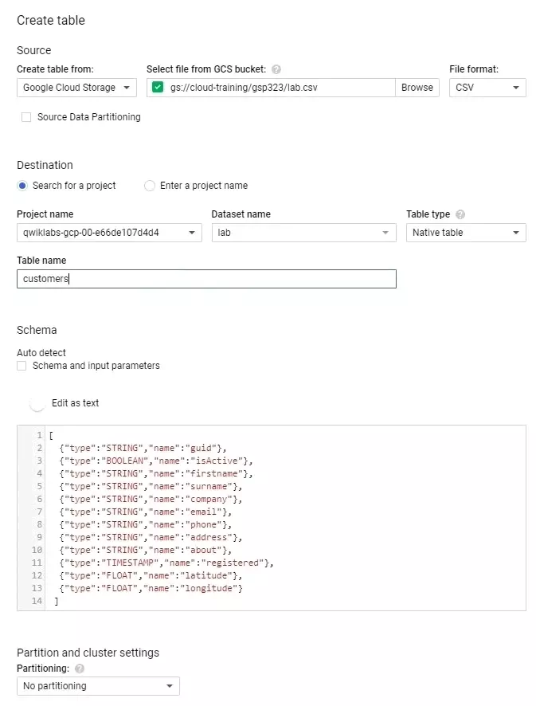
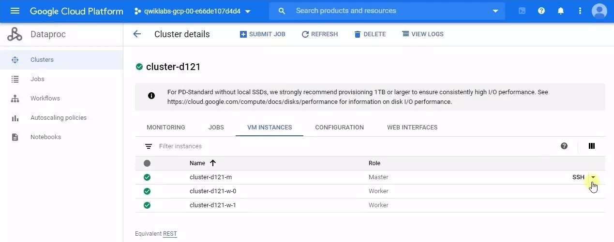

# Perform Foundational Data, ML, and AI Tasks in Google Cloud: Challenge Lab

## Task 1: Run a simple Dataflow job

### Create a BigQuery dataset called lab

- In the Cloud Console, click on Navigation Menu > BigQuery.
- Select your project in the left pane.
- Click CREATE DATASET.
- Enter ```lab``` in the Dataset ID, then click Create dataset.

- Run ```gsutil cp gs://cloud-training/gsp323/lab.schema .``` in the Cloud Shell to download the schema file.
- View the schema by running ```cat lab.schema```.

- Go back to the Cloud Console, select the new dataset lab and click Create Table.
- In the Create table dialog, select Google Cloud Storage from the dropdown in the Source section.
- Copy ```gs://cloud-training/gsp323/lab.csv``` to Select file from GCS bucket.
- Enter ```customers``` to “Table name” in the Destination section.
- Enable Edit as text and copy the JSON data from the lab.schema file to the textarea in the Schema section.
- Click Create table.

# 


### Create a Cloud Storage bucket

- In the Cloud Console, click on Navigation Menu > Storage.
- Click CREATE BUCKET.
- Copy your GCP Project ID to Name your bucket.
- Click CREATE.


### Create a Dataflow job
- In the Cloud Console, click on Navigation Menu > Dataflow.
- Click CREATE JOB FROM TEMPLATE.
- In Create job from template, give an arbitrary job name.
- From the dropdown under Dataflow template, select Text Files on Cloud Storage BigQery under “Process Data in Bulk (batch)”. (DO NOT select the item under “Process Data Continuously (stream)”).

# 

- Under the Required parameters, enter the following values:

```
JavaScript UDF path in Cloud Storage:       gs://cloud-training/gsp323/lab.js

JSON path:                                  gs://cloud-training/gsp323/lab.schema

JavaScript UDF name:                        transform

BigQuery output table:                      YOUR_PROJECT:lab.customers

Cloud Storage input path:                   gs://cloud-training/gsp323/lab.csv

Temporary BigQuery directory:               gs://YOUR_PROJECT/bigquery_temp

Temporary location:                         gs://YOUR_PROJECT/temp
```

Replace ```YOUR_PROJECT``` with your project ID.

- Click RUN JOB.


## Task 2: Run a simple Dataproc job

### Create a Dataproc cluster
- In the Cloud Console, click on Navigation Menu > Dataproc > Clusters.
- Click CREATE CLUSTER.
- Make sure the cluster is going to create in the region us-central1.
- Click Create.
- After the cluster has been created, clik the SSH button in the row of the master instance.

# 

- In the SSH console, run the following command:
```
hdfs dfs -cp gs://cloud-training/gsp323/data.txt /data.txt
```

- Close the SSH window and go back to the Cloud Console.
- Click SUBMIT JOB in the cluster details page.
- Select Spark from the dropdown of “Job type”.
- Copy ```org.apache.spark.examples.SparkPageRank``` to “Main class or jar”.
- Copy ```file:///usr/lib/spark/examples/jars/spark-examples.jar``` to “Jar files”.
- Enter ```/data.txt``` to “Arguments”.
- Click CREATE.


## Task 3: Run a simple Dataprep job

### Import runs.csv to Dataprep
- In the Cloud Console, click on Navigation menu > Dataprep.
- After entering the home page of Cloud Dataprep, click the "Import Data" button.
- In the Import Data page, select "GCS" in the left pane.
- Click on the pencil icon under Choose a file or folder.
- Copy ```gs://cloud-training/gsp323/runs.csv``` to the textbox, and click the Go button next to it.
- After showing the preview of runs.csv in the right pane, click on the Import & Wrangle button.

### Transform data in Dataprep
- After launching the Dataperop Transformer, scroll right to the end and select column10.
- In the Details pane, click FAILURE under Unique Values to show context menu.
- Select "Delete rows with selected values" to Remove all rows with the state of “FAILURE”.

- Click the downward arrow next to column9, choose Filter rows > On column value > Contains.
- In the Filter rows pane, enter the regex pattern ```/(^0$|^0\.0$)/``` to “Pattern to match”.
- Select Delete matching rows under the Action section, then click the "Add" button.

- Rename the columns to be:
```
    runid
    userid
    labid
    lab_title
    start
    end
    time
    score
    state
```

- Click "Run Job".


## Task 4: AI
**(Perform any one of the three subtasks below)**

## Use Google Cloud Speech API to analyze the audio file
- In the Cloud Console, click on Navigation menu > APIs & Services > Credentials.
-In the Credentials page, click on + CREATE CREDENTIALS > API key.
- Copy the API key to clipboard, then click RESTRICT KEY.
- Open the Cloud Shell, store the API key as an environment variable by running the following command:
```
export API_KEY=<YOUR-API-KEY>
```

- In the Cloud Shell, create a JSON file called ```gsc-request.json```.
- Save the following codes to the file.

```
{
  "config": {
      "encoding":"FLAC",
      "languageCode": "en-US"
  },
  "audio": {
      "uri":"gs://cloud-training/gsp323/task4.flac"
  }
}
```

- Use the following ```curl``` command to submit the request to Google Cloud Speech API and store the response to a file called ```task4-gcs.result```.
```
curl -s -X POST -H "Content-Type: application/json" --data-binary @gsc-request.json \
"https://speech.googleapis.com/v1/speech:recognize?key=${API_KEY}" > task4-gcs.result
```

- Upload the resulted file to Cloud Storage by running:
```
gsutil cp task4-gcs.result gs://<YOUR-PROJECT_ID>-marking/task4-gcs.result
```


## Use the Cloud Natural Language API to analyze the sentence

```
gcloud iam service-accounts create my-natlang-sa \
  --display-name "my natural language service account"
```

```
gcloud iam service-accounts keys create ~/key.json \
  --iam-account my-natlang-sa@${GOOGLE_CLOUD_PROJECT}.iam.gserviceaccount.com
```

```
export GOOGLE_APPLICATION_CREDENTIALS="/home/$USER/key.json"
```

```
gcloud auth activate-service-account my-natlang-sa@${GOOGLE_CLOUD_PROJECT}.iam.gserviceaccount.com --key-file=$GOOGLE_APPLICATION_CREDENTIALS
```

```
gcloud ml language analyze-entities --content="Old Norse texts portray Odin as one-eyed and long-bearded, frequently wielding a spear named Gungnir and wearing a cloak and a broad hat." > result.json
```

```
gcloud auth login 
(Copy the token from the link provided)
```

```
gsutil cp result.json gs://<YOUR_PROJECT_ID>-marking/task4-cnl.result
```


## Use Google Video Intelligence and detect all text on the video

```
gcloud iam service-accounts create quickstart
```

```
gcloud iam service-accounts keys create key.json --iam-account quickstart@${GOOGLE_CLOUD_PROJECT}.iam.gserviceaccount.com
```

```
gcloud auth activate-service-account --key-file key.json
```

```
export ACCESS_TOKEN=$(gcloud auth print-access-token)
```

```
nano request.json
```

```
{
   "inputUri":"gs://spls/gsp154/video/chicago.mp4",
   "features": [
       "TEXT_DETECTION"
   ]
}
```

```
curl -s -H 'Content-Type: application/json' \
    -H "Authorization: Bearer $ACCESS_TOKEN" \
    'https://videointelligence.googleapis.com/v1/videos:annotate' \
    -d @request.json
```

```
curl -s -H 'Content-Type: application/json' -H "Authorization: Bearer $ACCESS_TOKEN" 'https://videointelligence.googleapis.com/v1/operations/OPERATION_FROM_PREVIOUS_REQUEST' > result1.json
```

```
gsutil cp result1.json gs://<YOUR_PROJECT_ID>-marking/task4-gvi.result
```
