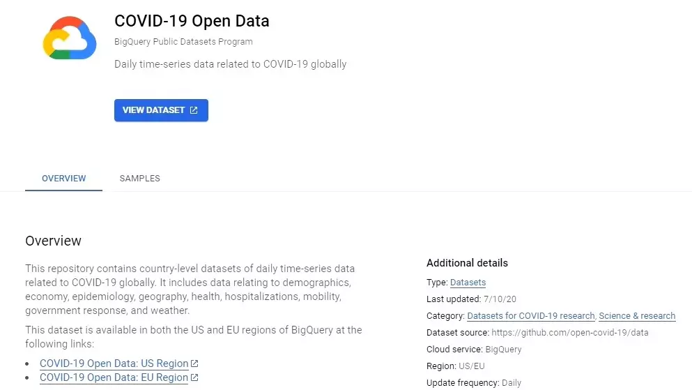

# Insights from Data with BigQuery: Challenge Lab

## Setup Required:

#### Open Public Dataset:

- In the Cloud Console, navigate to Menu > BigQuery.
- Click + ADD DATA > Explore public datasets from the left pane.
- Search covid19_open_data and then select COVID-19 Open Data
- Use Filter to locate the table covid19_open_data under the covid19_open_data dataset.

# 

## Query 1: Total Confirmed Cases

```
SELECT
  SUM(cumulative_confirmed) AS total_cases_worldwide
FROM
  `bigquery-public-data.covid19_open_data.covid19_open_data`
WHERE
  date = "2020-04-15"
```

## Query 2: Worst Affected Areas

```
SELECT
    COUNT(*) AS count_of_states
FROM (
SELECT
    subregion1_name AS state,
    SUM(cumulative_deceased) AS death_count
FROM
  `bigquery-public-data.covid19_open_data.covid19_open_data`
WHERE
  country_name="United States of America"
  AND date='2020-04-10'
  AND subregion1_name IS NOT NULL
GROUP BY
  subregion1_name
)
WHERE death_count > 100
```

## Query 3: Identifying Hotspots

```
SELECT subregion1_name as state, sum(cumulative_confirmed) as total_confirmed_cases
FROM `bigquery-public-data.covid19_open_data.covid19_open_data`
where country_name="United States of America" and date='2020-04-10' and subregion1_name is NOT NULL
group by subregion1_name
having total_confirmed_cases > 1000
order by total_confirmed_cases desc
```

## Query 4: Fatality Ratio

```
SELECT SUM(cumulative_confirmed) AS total_confirmed_cases, SUM(cumulative_deceased) AS total_deaths, (SUM(cumulative_deceased)/SUM(cumulative_confirmed))*100 AS case_fatality_ratio
FROM `bigquery-public-data.covid19_open_data.covid19_open_data`
WHERE country_name="Italy" AND date BETWEEN "2020-04-01" AND "2020-04-30"
```

## Query 5: Identifying specific day

```
SELECT date
FROM `bigquery-public-data.covid19_open_data.covid19_open_data`
where country_name="Italy" and cumulative_deceased>10000
order by date asc
limit 1
```

## Query 6: Finding days with zero net new cases

```
WITH india_cases_by_date AS (
  SELECT
    date,
    SUM(cumulative_confirmed) AS cases
  FROM
    `bigquery-public-data.covid19_open_data.covid19_open_data`
  WHERE
    country_name="India"
    AND date between '2020-02-21' and '2020-03-15'
  GROUP BY
    date
  ORDER BY
    date ASC
 )

, india_previous_day_comparison AS
(SELECT
  date,
  cases,
  LAG(cases) OVER(ORDER BY date) AS previous_day,
  cases - LAG(cases) OVER(ORDER BY date) AS net_new_cases
FROM india_cases_by_date
)
SELECT
  COUNT(date)
FROM
  india_previous_day_comparison
WHERE
  net_new_cases = 0
```

## Query 7: Doubling rate

```
WITH us_cases_by_date AS (
  SELECT
    date,
    SUM( cumulative_confirmed ) AS cases
  FROM
    `bigquery-public-data.covid19_open_data.covid19_open_data`
  WHERE
    country_name="United States of America"
    AND date between '2020-03-22' and '2020-04-20'
  GROUP BY
    date
  ORDER BY
    date ASC
 )

, us_previous_day_comparison AS
(SELECT
  date,
  cases,
  LAG(cases) OVER(ORDER BY date) AS previous_day,
  cases - LAG(cases) OVER(ORDER BY date) AS net_new_cases,
  (cases - LAG(cases) OVER(ORDER BY date))*100/LAG(cases) OVER(ORDER BY date) AS percentage_increase
FROM us_cases_by_date
)
SELECT
  Date,
  cases AS Confirmed_Cases_On_Day,
  previous_day AS Confirmed_Cases_Previous_Day,
  percentage_increase AS Percentage_Increase_In_Cases
FROM
  us_previous_day_comparison
WHERE
  percentage_increase > 10
```

## Query 8: Recovery rate

```
WITH cases_by_country AS (
  SELECT
    country_name AS country,
    SUM(cumulative_confirmed) AS cases,
    SUM(cumulative_recovered) AS recovered_cases
  FROM
    `bigquery-public-data.covid19_open_data.covid19_open_data`
  WHERE
    date="2020-05-10"
  GROUP BY
    country_name
)

, recovered_rate AS (
  SELECT
    country, cases, recovered_cases,
    (recovered_cases * 100)/cases AS recovery_rate
  FROM
    cases_by_country
)

SELECT country, cases AS confirmed_cases, recovered_cases, recovery_rate
FROM
   recovered_rate
WHERE
   cases > 50000
ORDER BY recovery_rate DESC
LIMIT 10
```

## Query 9: CDGR - Cumulative Daily Growth Rate

```
WITH
  france_cases AS (
  SELECT
    date,
    SUM(cumulative_confirmed) AS total_cases
  FROM
    `bigquery-public-data.covid19_open_data.covid19_open_data`
  WHERE
    country_name="France"
    AND date IN ('2020-01-24',
      '2020-05-10')
  GROUP BY
    date
  ORDER BY
    date)
, summary as (
SELECT
  total_cases AS first_day_cases,
  LEAD(total_cases) OVER(ORDER BY date) AS last_day_cases,
  DATE_DIFF(LEAD(date) OVER(ORDER BY date),date, day) AS days_diff
FROM
  france_cases
LIMIT 1
)

select first_day_cases, last_day_cases, days_diff, POW((last_day_cases/first_day_cases),(1/days_diff))-1 as cdgr
from summary
```

## Create a Datastudio report

- Enter the following code in the BigQuery editor and Run:

```
SELECT
  date, SUM(cumulative_confirmed) AS country_cases,
  SUM(cumulative_deceased) AS country_deaths
FROM
  `bigquery-public-data.covid19_open_data.covid19_open_data`
WHERE
  date BETWEEN '2020-03-15'
  AND '2020-04-30'
  AND country_name ="United States of America"
GROUP BY date
```

- Click On EXPLORE DATA > Explore with Data Studio.
- Authorize your BigQuery in Data Studio
- You may fail to create a report for the first-time logon of Data Studio. Click + Blank Report and accept the Terms of Service. Go back to the BigQuery page and click Explore with Data Studio again.
- In the new Data Studio report, select Add a chart > Time series Chart.
- Add country_cases and country_deaths to the Metric field.
- Click Save to commit the change.

##### If anyhow you fail to get score of this task, remove all data and reports from the Datastudio console before retry.
