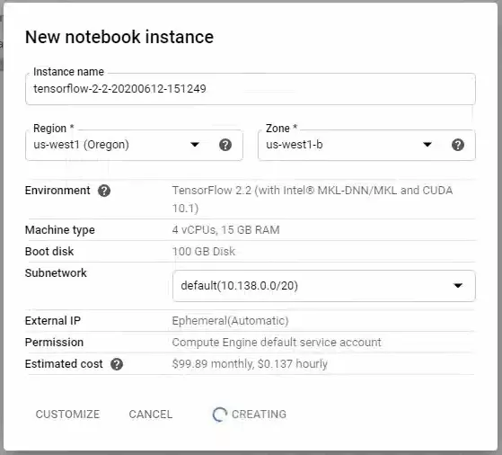
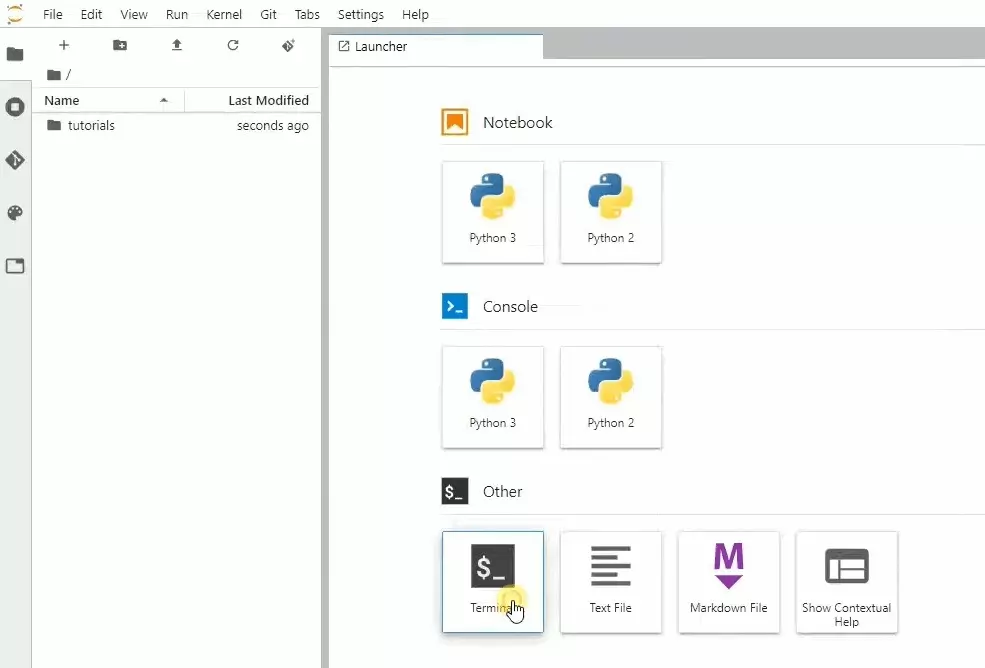
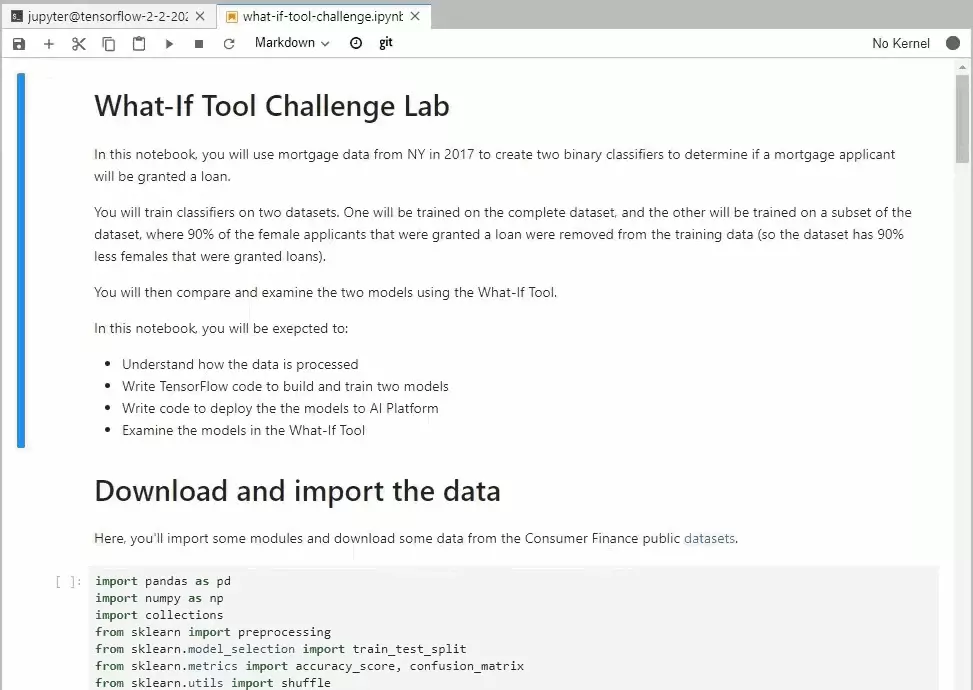
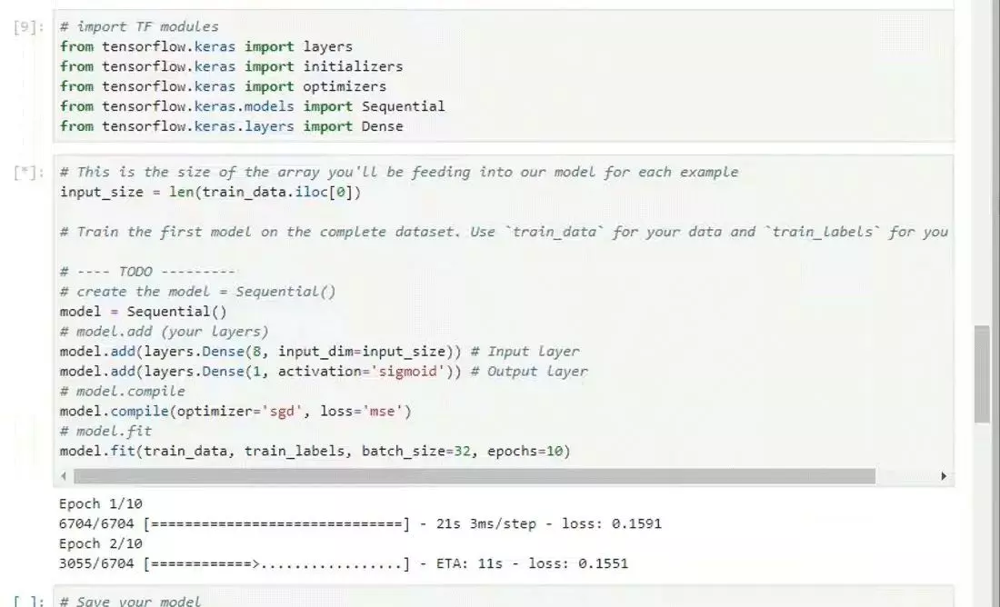
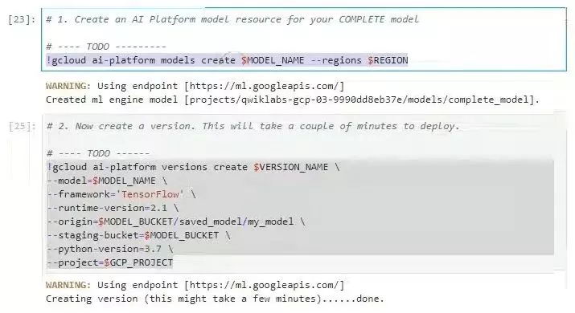
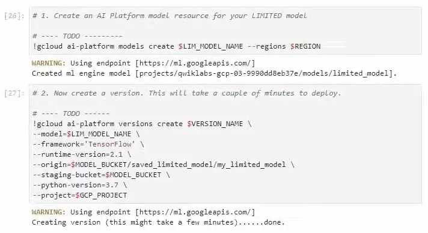
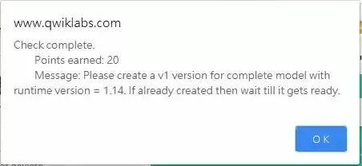
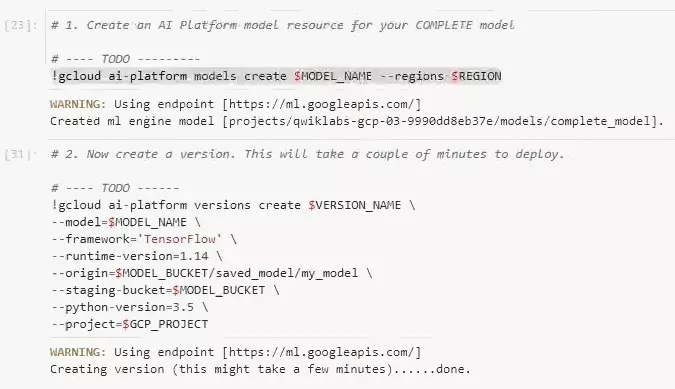
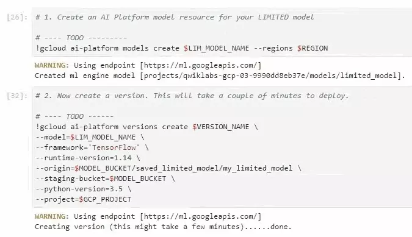

# Explore Machine Learning Models with Explainable AI: Challenge Lab
## Start a JupyterLab Notebook instance

-  In the Cloud Console, in the Search bar, type in  **Notebook**.
-  Select  **Notebook**  for  **AI Platform**.
-  On the Notebook instances page, click  **New Instance**.
-   In the Customize instance menu, select the latest version of  TensorFlow and then select **_without_  GPUs**.
-  In the  **New notebook instance**  dialog, accept the default options and click  **Create**.

# 

-  After a few minutes, the AI Platform console will display your instance name, followed by Open Jupyterlab.  
      
    Click  **Open JupyterLab**. Your notebook is now set up.

## Download the Challenge Notebook

-  In your notebook, click the  **terminal**.
# 
-  Clone the repo:
```
git clone https://github.com/GoogleCloudPlatform/training-data-analyst
```
-  Go to the enclosing folder:  `training-data-analyst/quests/dei`
-  Open the notebook file  `what-if-tool-challenge.ipynb`.
# 

- Download and import the dataset  `hmda_2017_ny_all-records_labels`  by running the first to the eighth cells (the  **Get the Train & Test Data**  section).


## Build and train your models

1.  In the second cell of the  **Train your first model on the complete dataset**  section, add the following lines to create the model.

```
model = Sequential()
model.add(layers.Dense(8, input_dim=input_size))
model.add(layers.Dense(1, activation='sigmoid'))
model.compile(optimizer='sgd', loss='mse')
model.fit(train_data, train_labels, batch_size=32, epochs=10)
```

   #  


2.  Copy the code for training the second model. Modify  `model`  to  `limited_model`  as well as  `train_data, train_labels`  to  `limited_train_data, limited_train_labels`. The code for the second model should look like the following.

```
limited_model = Sequential()
limited_model.add(layers.Dense(8, input_dim=input_size))
limited_model.add(layers.Dense(1, activation='sigmoid'))
limited_model.compile(optimizer='sgd', loss='mse')
limited_model.fit(limited_train_data, limited_train_labels, batch_size=32, epochs=10)  
```

3.  Run the cells in this section and wait for the finish of model training.


## Deploy the models to AI Platform

Moving on to the  **Deploy your models to the AI Platform**  section in the notebook.

1.  Navigate to Storage and create a bucket with unique bucket name. 
2.  Replace the values of  `GCP_PROJECT`  and  `MODEL_BUCKET`  with your project ID and the bucket name.
3.  Change the  `REGION`  to  `us-west1`.
4.  Run those three cells and then confirm the created bucket and the uploaded model files in the Cloud Storage.

# 


### Create your first AI Platform model: complete_model

4.  Add the following codes to the notebook cells for your COMPLETE model.

```
!gcloud ai-platform models create $MODEL_NAME --regions $REGION  
```

```
!gcloud ai-platform versions create $VERSION_NAME \
--model=$MODEL_NAME \
--framework='TensorFlow' \
--runtime-version=2.1 \
--origin=$MODEL_BUCKET/saved_model/my_model \
--staging-bucket=$MODEL_BUCKET \
--python-version=3.7 \
--project=$GCP_PROJECT
```

# 

Created your first AI Platform model: complete_model  
(With parameters --runtime-version=2.1, --python-version=3.7)

### Create your second AI Platform model: limited_model


5.  Add the following codes to the notebook cells for your LIMITED model.

```
!gcloud ai-platform models create $LIM_MODEL_NAME --regions $REGION
```
    
```
!gcloud ai-platform versions create $VERSION_NAME \
--model=$LIM_MODEL_NAME \
--framework='TensorFlow' \
--runtime-version=2.1 \
--origin=$MODEL_BUCKET/saved_limited_model/my_limited_model \
--staging-bucket=$MODEL_BUCKET \
--python-version=3.7 \
--project=$GCP_PROJECT
```
    
    **Remark**: The gcloud ai-platform command group should be  `versions`  rather than  `version`.

# 

Created your second AI Platform model: limited_model  
(With params --runtime-version=2.1, --python-version=3.7)

### Troubleshooting runtime version issue

While the notebook guided to create the models with runtime version 2.1 and Python 3.7, the checkpoint message specified the required runtime version = 1.14 as shown in the below picture.

# 

Checkpoint requirement for creating your AI Platform models

Unfortunately, it still doesn’t work if you just change the runtime version from 2.1 to 1.14. The runtime version 1.14 must be coupled with Python 3.5, according to the  AI Platform Documentation. Thus, after replacing the runtime and Python version numbers, correspondingly, the codes for creating the AI Platform models should be modified as shown below.

##### Create your first AI Platform model: complete_model  
(Fixed with --runtime-version=1.14, --python-version=3.5)

# 

##### Create your second AI Platform model: limited_model  
(Fixed with --runtime-version=1.14, --python-version=3.5)

# 

## Use the What-If Tool to explore biases

Run the last cell in the notebook to activate What-If Tool. Explore the differences between the two models and you should be able to get the answers as follows:

1. In the Performance and Fairness tab, slice by sex (applicant_sex_name_Female). How does the complete model compare to the limited model for females?

    **Ans:** The complete model has equal performance across sexes, whereas the limited model is much worse on females.


2. Click on one of the datapoints in the middle of the arc. In the datapoint editor, change (applicant_sex_name_Female) to 0, and (applicant_sex_name_Male) to 1. Now run the inference again. How does the model change?

    **Ans:** The limited model has a significantly larger delta than the complete model, whereas the complete model has almost no change.

3. In the Performance and Fairness tab, use the fairness buttons to see the thresholds for the sexes for demographic parity between males and females. How does this change the thresholds for the limited model?

    **Ans:** The thresholds have to be wildly different for the limited model.

**Congratulations! You have completed this challenge lab.**
